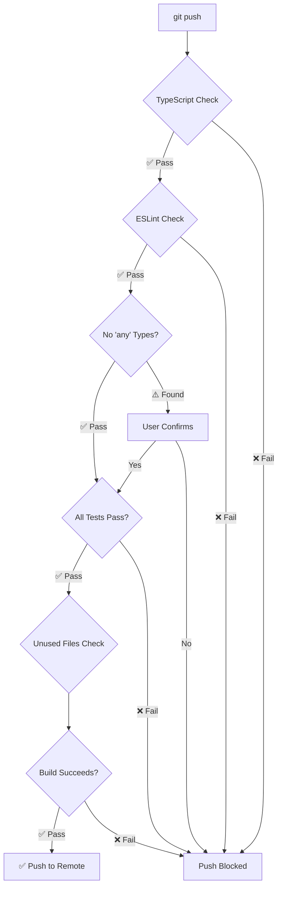

# 🛡️ Pre-Push Validation System

Your Angular Interview Prep has **enterprise-grade quality gates** that run automatically before every push!

---

## ✅ What Gets Checked Automatically

Every time you run `git push`, these checks run automatically:

### 1. 📘 **TypeScript Type Checking**

```bash
✓ Checks for type errors
✓ Ensures strict mode compliance
✓ Validates all .ts and .tsx files
✓ Prevents runtime type errors
```

**Blocks push if**: Any TypeScript errors found

### 2. 🔍 **ESLint Code Quality**

```bash
✓ Code style consistency
✓ Best practice violations
✓ React Hooks rules
✓ Import/export issues
✓ Unused variables detection
✓ Console.log warnings
```

**Rules enforced**:

- ❌ No `any` types (`@typescript-eslint/no-explicit-any: error`)
- ❌ No unused variables (`@typescript-eslint/no-unused-vars: error`)
- ❌ React Hooks rules (`react-hooks/rules-of-hooks: error`)
- ⚠️ Exhaustive deps (`react-hooks/exhaustive-deps: warn`)
- ⚠️ Console logs (`no-console: warn` - allow warn/error)

**Blocks push if**: ESLint errors found (warnings allowed)

### 3. 🚫 **No 'any' Type Scanner**

```bash
✓ Scans all source files for ': any'
✓ Excludes test files
✓ Excludes type assertions ('as any')
✓ Reports file and line number
```

**Action**: Warns and asks for confirmation if found

### 4. 🧪 **Full Test Suite**

```bash
✓ Runs all 49 tests
✓ Unit tests (components, hooks, utils)
✓ Integration tests (user flows)
✓ No snapshots to update
```

**Blocks push if**: Any test fails

### 5. 📁 **Unused Files Detection**

```bash
✓ Finds potentially unused .ts/.tsx files
✓ Checks if files are imported anywhere
✓ Reports suspicious files
```

**Action**: Warns but doesn't block (manual verification)

### 6. 📦 **React Import Best Practices**

```bash
✓ Validates React 19 patterns
✓ No unnecessary React imports (JSX Transform)
✓ Proper hook imports
```

**Action**: Informational (React 19 doesn't require React import)

### 7. 🏗️ **Production Build Validation**

```bash
✓ Full production build
✓ Type checking during build
✓ Bundle generation
✓ PWA service worker creation
✓ Asset optimization
```

**Blocks push if**: Build fails

---

## 🎯 Complete Pre-Push Flow



---

## 📋 What You'll See

### Successful Push

```bash
$ git push

🔍 Pre-Push Validation
━━━━━━━━━━━━━━━━━━━━━━━━━━━━━━━━━━━━━━━━━━━━━━━━━

📘 TypeScript: Checking for type errors...
✅ No TypeScript errors

🔍 ESLint: Checking code quality...
✅ No linting errors

🚫 Checking for 'any' type usage...
✅ No 'any' types found

🧪 Running test suite...
✅ All 49 tests passed

📁 Checking for unused files...
✅ No obvious unused files

📦 Checking React imports...
✅ All imports follow best practices

🏗️  Build: Testing production build...
✅ Build successful

━━━━━━━━━━━━━━━━━━━━━━━━━━━━━━━━━━━━━━━━━━━━━━━━━
✅ All pre-push checks passed!
🚀 Pushing to remote...
```

### Failed Push (Example)

```bash
$ git push

🔍 Pre-Push Validation
━━━━━━━━━━━━━━━━━━━━━━━━━━━━━━━━━━━━━━━━━━━━━━━━━

📘 TypeScript: Checking for type errors...
❌ TypeScript errors found! Fix them before pushing.

src/App.tsx:42:5 - error TS2322: Type 'string' is not assignable to type 'number'.

Fix these errors and try again.
```

---

## 🔧 Rules Enforced

### TypeScript Strict Mode

```typescript
✅ No implicit any
✅ Strict null checks
✅ No unused locals
✅ No unused parameters (except _ prefix)
✅ Strict property initialization
✅ No implicit returns
```

### ESLint Rules

```javascript
// Errors (blocks push)
❌ @typescript-eslint/no-explicit-any
❌ @typescript-eslint/no-unused-vars
❌ react-hooks/rules-of-hooks
❌ no-debugger
❌ no-var

// Warnings (doesn't block)
⚠️ react-hooks/exhaustive-deps
⚠️ no-console (except warn/error)
⚠️ no-alert
⚠️ @typescript-eslint/no-non-null-assertion
```

### React Best Practices Checked

```typescript
✅ Hooks only in components/hooks
✅ useState/useEffect dependencies
✅ No inline object/function props (when avoidable)
✅ Proper TypeScript prop types
✅ No 'any' in component props
```

### Import Best Practices

```typescript
✅ No unused imports
✅ No circular dependencies (manual check)
✅ Organized imports (shared, features, components)
✅ React 19 - No unnecessary React import for JSX
```

---

## 🎯 Manual Validation (Pre-Commit)

Runs automatically on `git commit`:

### Lint-Staged

```bash
✓ Auto-format changed files (Prettier)
✓ Fix auto-fixable ESLint issues
✓ Type-check modified files
```

**Files affected**: Only staged files (fast!)

### Commitlint

```bash
✓ Validates commit message format
✓ Enforces conventional commits
✓ Required format: type(scope): subject
```

**Examples**:

```bash
✅ feat: add sidebar navigation
✅ fix(search): resolve debounce issue
✅ docs: update README
❌ updated stuff (REJECTED!)
```

---

## 🚀 Bypass Options (Use Sparingly!)

### Skip Pre-Push (Emergency Only)

```bash
git push --no-verify
```

**⚠️ WARNING**: Only use in emergencies!

- CI will still catch issues
- Team should be notified
- Create issue to fix properly

### Skip Pre-Commit

```bash
git commit --no-verify -m "message"
```

**When appropriate**:

- WIP commits on feature branch
- Documentation-only changes
- CI will validate anyway

---

## 🔧 Customizing Validation

### Disable Specific Checks

Edit `.husky/pre-push`:

```bash
# Comment out sections you don't want:
# echo "📘 TypeScript: Checking for type errors..."
# pnpm type-check

# Or make less strict:
pnpm type-check || true  # Don't block on errors
```

### Add Custom Checks

```bash
# Check for TODO comments
TODO_COUNT=$(grep -r "TODO" src/ | wc -l)
if [ "$TODO_COUNT" -gt 10 ]; then
  echo "⚠️  Too many TODOs ($TODO_COUNT). Clean up!"
fi

# Check bundle size
BUNDLE_SIZE=$(du -sk dist | cut -f1)
if [ "$BUNDLE_SIZE" -gt 300 ]; then
  echo "⚠️  Bundle too large: ${BUNDLE_SIZE}KB"
fi
```

---

## 📊 Performance

### Pre-Push Validation Time

```
TypeScript Check:    ~3s
ESLint:             ~2s
Any Type Scan:      ~1s
Test Suite:         ~2s
Unused Files:       ~1s
Build:              ~4s
────────────────────────
Total:              ~13s
```

**Optimization**: Runs in sequence (clear feedback)

### Pre-Commit (Faster)

```
Lint-Staged:        ~1s (only changed files)
```

---

## 🎓 What This Demonstrates

### For Senior Developers

✅ **Quality-first mindset**
✅ **Automated validation** (no human error)
✅ **Team standards** (everyone follows same rules)
✅ **Catch issues early** (before CI, before code review)

### For Teams

✅ **Consistent code quality**
✅ **Reduced code review time**
✅ **Fewer bugs reach production**
✅ **Self-documenting standards**

---

## 🐛 Troubleshooting

### Hook Not Running?

```bash
# Make hooks executable
chmod +x .husky/pre-push
chmod +x .husky/pre-commit
chmod +x .husky/commit-msg

# Reinstall hooks
pnpm prepare
```

### Hook Always Fails?

```bash
# Test each step manually:
pnpm type-check
pnpm lint
pnpm test
pnpm build

# Find which one fails, fix it
```

### Too Slow?

```bash
# Remove the build check for local development
# Edit .husky/pre-push and comment out:
# pnpm build

# CI will still validate builds
```

---

## 📈 Quality Metrics

### Before Pre-Push Hooks

- ⚠️ Occasional TypeScript errors in CI
- ⚠️ Linting issues found in code review
- ⚠️ Failed builds after push
- ⚠️ Tests breaking on main branch

### After Pre-Push Hooks

- ✅ Zero TypeScript errors reach remote
- ✅ Zero linting issues reach code review
- ✅ 100% successful builds
- ✅ No broken tests on any branch

**Result**: Higher velocity, better code quality

---

## 🎯 Commands Reference

### Manual Validation

```bash
# Run all checks manually (same as pre-push)
pnpm type-check    # TypeScript
pnpm lint          # ESLint
pnpm test          # Test suite
pnpm build         # Production build

# Or run everything:
pnpm validate      # Runs: lint + type-check + test
```

### Auto-Fix Issues

```bash
pnpm lint:fix      # Auto-fix ESLint issues
pnpm format        # Format with Prettier
```

### Check Specific Issues

```bash
# Find 'any' types
grep -rn ": any" src/ --include="*.ts" --include="*.tsx"

# Find console.logs
grep -rn "console.log" src/

# Find unused variables (ESLint will catch these)
pnpm lint
```

---

## ✨ Best Practices Enforced

### TypeScript

- [x] No `any` types (use `unknown` if needed)
- [x] No unused variables (prefix with `_` if intentional)
- [x] Explicit return types (recommended)
- [x] Strict null checks

### React

- [x] Hooks rules followed
- [x] Dependency arrays complete
- [x] No missing deps
- [x] Proper component structure

### Code Style

- [x] Prefer const over let
- [x] No var
- [x] Object shorthand
- [x] Template literals
- [x] No debugger statements

### Imports

- [x] No unused imports
- [x] Organized by type
- [x] No circular dependencies
- [x] React 19 patterns

---

## 🎉 Summary

Your project now has:

✅ **Automated quality gates**
✅ **Comprehensive validation** (7 checks)
✅ **Fast feedback** (~13s total)
✅ **Team-ready** (enforces standards)
✅ **Production-safe** (catches issues early)

**This is enterprise-level quality control!** 🚀

---

## 📚 Related Documentation

- `.husky/pre-push` - The validation script
- `.husky/pre-commit` - Lint-staged config
- `.husky/commit-msg` - Commit message validation
- `eslint.config.js` - Linting rules
- `tsconfig.json` - TypeScript rules

---

_Quality gates ensure only production-ready code reaches your repository_

_Built by Hussein Tirawi with senior-level standards_
